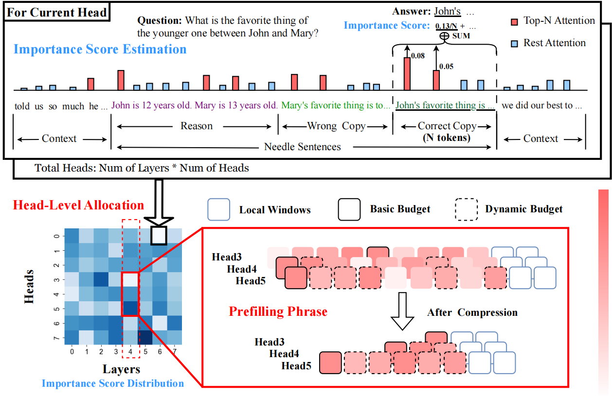
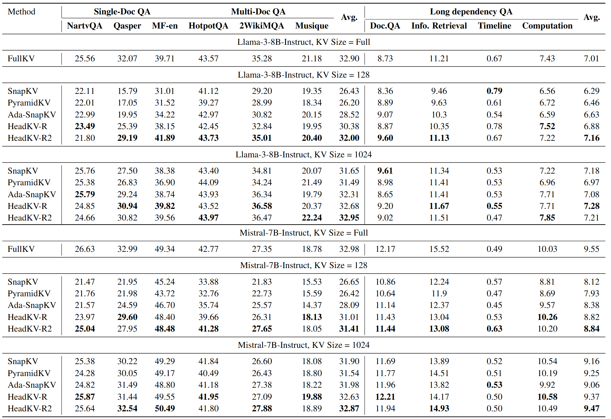
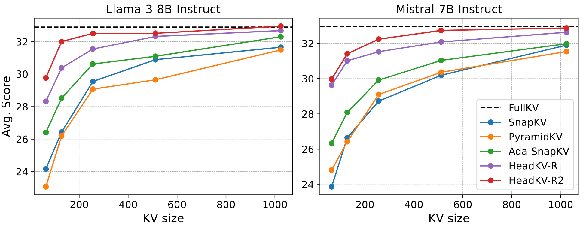

# HeadKV


## Model


## Performance



## Important Head
To obtain the head-level importance score distribution for guiding the global KV cache budget allocation, we use [Retrieval Heads](https://github.com/nightdessert/Retrieval_Head/tree/main) method. More details can be found in `Important_Head` folder and the [Retrieval Heads](https://github.com/nightdessert/Retrieval_Head/tree/main) project.
 
## Load importance score distribution

By default, we will load the head-level importance score distribution in the `headkv/snapkv_utils.py:ReasonSnapKVCluster()`. We will load json file from `./Important_Head/head_score/` to access these distributions. If you want to use your own distribtiion, please make sure to change these codes.
```python
with open(path, 'r') as file:
    head_list = json.loads(file.readline())
head_score_list = [np.mean(l[1]) for l in head_list.items()]
head_score_list = torch.tensor(head_score_list / sum(head_score_list))
```
We leverage the normalized head-level importance score distribution for budget allocation. Please refers to `Important_Head` folder for more details.


## HeadKV Inference

```python
max_capacity_prompts=128 # 64, 128, 256, 512, 1024
devices=(0 1 2 3 4 5 6 7 8)
head_choices=('reason') #  copy, reason
betas=(1.005 1.01 1.1 1.2 1.5 2 5 10)
method='ReasonKV'
counter=0
for((i=0;i<1;i++));do 
    for((j=0;j<8;j++));do
        device=${devices[counter]}
        head_choice=${head_choices[i]}
        beta=${betas[j]}
        temp=1
        nohup bash head_base.sh \
            $device \
            $method \
            ${max_capacity_prompts} \
            flash_attention_2 \
            meta-llama/Meta-Llama-3-8B-Instruct \
            $head_choice \
            $beta \
            $temp > ./longbench_logs/llama3_${method}_${head_choice}_base${max_capacity_prompts}_beta${beta}_temp${temp}.txt 2>&1 &
        ((counter+=1))
    done
done
```
NOTES:
+ `method`: choose from [SnapKV, PyramidKV, AdativeKV, ReasonKV]. AdativeKV and ReasonKV are based on SnapKV.
+ `head_choice`: copy: Retrieval Heads. reason: Retrieval-Reasoning Heads
+ `beta`: define the global KV cache budget pool. A higher beta means a bigger global budget pool.
```python
total_pool_capacity = (self.base_capacity // self.beta) * self.num_hidden_layers * self.num_attention_heads
min_num = (self.base_capacity - self.base_capacity // self.beta)
self.head_capacity = torch.round(self.total_attention * total_pool_capacity + min_num).int()
```

## Needle-in-the haystack

```python
mkdir ./longbench_logs/
mkdir ./needle_results/

devices=(0 1 2 3 4 5 6 7)
head_choices=('reason') # copy, reason
betas=(1.005 1.01 1.1 1.2 1.5 2 5 10)
max_capacity_prompts=128
counter=0

for((i=0;i<1;i++));do 
    for((j=0;j<8;j++));do
        device=${devices[counter]}
        head_choice=${head_choices[i]}
        beta=${betas[j]}
        temp=1
        alpha=1

        bash needle_base.sh \
            $device \
            ReasonKV \
            ${max_capacity_prompts} \
            flash_attention_2 \
            meta-llama/Meta-Llama-3-8B-Instruct \
            $head_choice \
            $beta \
            $temp \
            1000 \
            8001 \
            1000 \
            LLaMA3 \
            Meta-Llama-3-8B-Instruct > ./longbench_logs/llama3_ReasonKV_${head_choice}_base${max_capacity_prompts}_beta${beta}_temp${temp}.txt 2>&1 &
        ((counter+=1))
    done
done
```
We adapt the `needle-in-a-haystack` code from [PyramidKV](https://github.com/Zefan-Cai/PyramidKV/tree/main). Please refer to this project for more details.


## Reason-in-a-haystack
```python
max_capacity_prompts=128 
head_choices=('reason') # copy, reason
# betas=(1.02 1.005 1.1 1.2 1.5 2 5 10) # 64 
betas=(1.005 1.01 1.1 1.2 1.5 2 5 10) # 128 256 512 
counter=0
for((i=0;i<1;i++));do 
    for((j=0;j<8;j++));do
        device=${devices[counter]}
        head_choice=${head_choices[i]}
        beta=${betas[j]}
        temp=1
        nohup bash head_base_babi.sh \
            $device \
            ReasonKV \
            ${max_capacity_prompts} \
            flash_attention_2 \
            meta-llama/Meta-Llama-3-8B-Instruct \
            $head_choice \
            $beta \
            $temp > ./reason_logs/llama3_ReasonKV_${head_choice}_base${max_capacity_prompts}_beta${beta}_temp${temp}.txt 2>&1 &
        ((counter+=1))

    done
done
```
Reason-in-a-haystack experiments are conduct based on the data provided by [RMT-team](https://huggingface.co/datasets/RMT-team/babilong). 


## Citation
```markdown
@article{fu2024not,
  title={Not All Heads Matter: A Head-Level KV Cache Compression Method with Integrated Retrieval and Reasoning},
  author={Fu, Yu and Cai, Zefan and Asi, Abedelkadir and Xiong, Wayne and Dong, Yue and Xiao, Wen},
  journal={arXiv preprint arXiv:2410.19258},
  year={2024}
}
```

## Acknowledgement
We build our project based on [PyramidKV](https://github.com/Zefan-Cai/PyramidKV/tree/main), [Ada-KV](https://github.com/FFY0/AdaKV), [Retrieval Heads](https://github.com/nightdessert/Retrieval_Head/tree/main) and [babilong](https://github.com/booydar/babilong). Many thanks to them for providing open-source code and data!